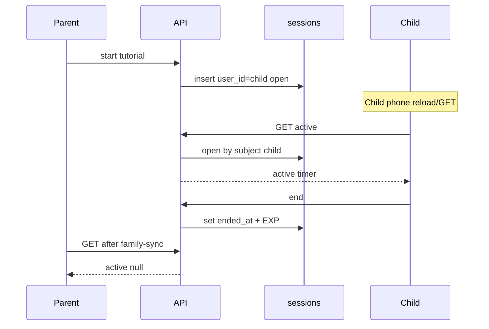

# Family-shared open sessions (Supabase)

## Current baseline (keep)

- Sessions already persist in Postgres via [`src/app/api/session/route.ts`](src/app/api/session/route.ts): `start` inserts with `ended_at` null; `end` sets duration/EXP.
- Parent tutorials already credit the child (`user_id` = primary child, `conducted_by_user_id` = parent).
- Child can already **end** a parent-started tutorial (row is owned by the child). Same-account iPad→phone already works once both devices call `GET /api/session`.

## Gaps to close



1. **Caller-scoped open lookup** — parent does not see child’s open **working** session; start check does not block “child working + parent tutorial” on the same child.
2. **No DB uniqueness** — races can create two open rows for one `user_id`.
3. Dashboard SSR mirrors the same caller-only open queries in [`src/app/(dashboard)/dashboard/page.tsx`](src/app/(dashboard)/dashboard/page.tsx).

## Chosen rules

- **Scope:** one open session per **child credit row** (`sessions.user_id` = that child). Parent household with one primary child (existing `resolvePrimaryChildId`) shares that single open slot.
- **Who can run the timer / end:** any linked party for that child — child as owner, parent as linked parent (RLS already allows parent update on linked child sessions). Explicitly keep **child may end parent-started tutorials**.
- **Who can start:** blocked with 409 if that child already has any open session (working or tutorial).
- **No Neon** — continue using Supabase `sessions` + existing family-sync Broadcast.

## Implementation

### 1. SQL: one open session per child

Add [`supabase/migrate_one_open_session.sql`](supabase/migrate_one_open_session.sql):

```sql
CREATE UNIQUE INDEX IF NOT EXISTS sessions_one_open_per_user
  ON sessions (user_id)
  WHERE ended_at IS NULL;
```

Document that this must be run in the Supabase SQL editor. Map unique violations in the API to 409.

### 2. Shared open-session resolver

In [`src/app/api/session/route.ts`](src/app/api/session/route.ts) (or a small helper in `src/lib/`):

- Resolve **subject child id**: for children = self; for parents = `resolvePrimaryChildId(linked_children)`.
- `fetchOpenSessionForSubject(supabase, subjectChildId)` → single open row `user_id = subject AND ended_at IS NULL` (latest if cleanup needed historically).
- Replace start’s “already running” check and end’s open fetch with this subject lookup (after auth + profile).
- `GET` returns that subject’s open session so parent phones show the child’s live working timer and both see tutorials.

Start insert path stays: child working → `user_id = self`; parent tutorial → `user_id = child`, conductor fields set. Before insert, refuse if subject already has open.

Handle unique-index errors on insert as 409 `"A session is already running"`.

### 3. Dashboard SSR aligned with API

In [`src/app/(dashboard)/dashboard/page.tsx`](src/app/(dashboard)/dashboard/page.tsx):

- Stop dual `openAsOwner` / `openAsConductor` maybeSingle split for “active”.
- Load open session with `user_id IN subjectIds` (or primary subject), `ended_at IS NULL`, same ordering as API so hydration matches `GET /api/session`.

### 4. Cross-device UX (light touch)

- Existing family-sync on start/end already refreshes active + `router.refresh()` — with subject-scoped GET, the other device/role picks up the same live session or cleared timer.
- No change required to claim-swipe persistence: EXP is committed on **end**; claim UI remains local.

### 5. Optional cleanup (include if any orphans exist)

One-time note in the migration comment: if production already has multiple open rows per `user_id`, end or delete extras **before** creating the unique index (or the index create fails). Provide a short commented cleanup query in the migration file.

## Out of scope

- Multi-primary-child simultaneous tutorials (product still uses one primary child).
- Changing EXP math or tutorial ×3.
- Neon or a second database.
- Persisting the post-end “Swipe to claim” sheet across reloads (session row is already saved on end).

## Verify manually

1. Parent starts tutorial on iPad → child phone shows running timer → child ends → both dashboards clear active; Finished shows one session.
2. Child starts working on phone → parent kicksheet shows that session (not a second start) → end from either side succeeds once.
3. Second start while open → 409; no second open row.
4. Reload mid-session restores timer from Supabase on both roles.
