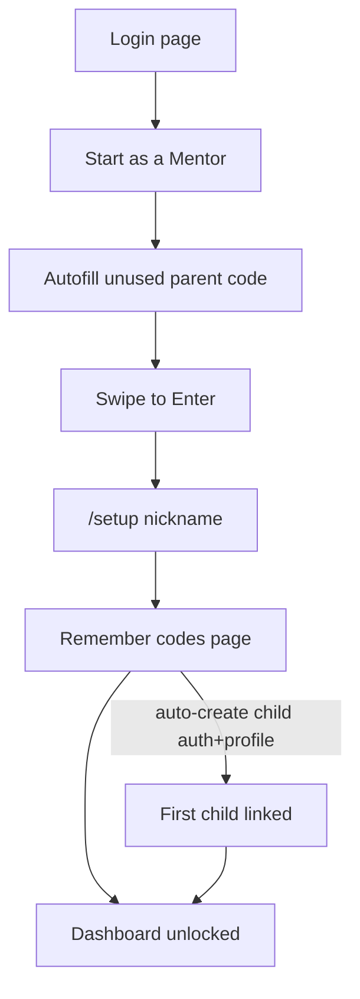

# Per-mentee blank lists, template import, public mentor onboarding

## Product rules (locked)

- **Mentee isolation:** Each mentee only sees their own `user_tasks` → `tasks` instance rows. No shared progress across mentees.
- **No preload:** New mentee accounts start with an **empty** task list (do not call bulk seed from all `tasks` / `task_exp.csv`).
- **`task_no`:** May duplicate per mentee (many instance rows). New novel `task_no` on create seeds a **separate** shared catalog template (`is_catalog_template = true`) for others to load.
- **Prerequisites:** Unlock only when **all** assigned instances of each required `task_no` are `claimed` (already in [`src/lib/task-prerequisites.ts`](src/lib/task-prerequisites.ts)).
- **Import button:** Parents only. Visible when selected mentee’s **Your Tasks** count is `0` (Locked + Finished ignored). Hidden once Your Tasks has any items (after import or after create that lands in Your Tasks).
- **`task_exp.csv`:** Sample **template** only — applied when parent presses Import (not on account create). Long details come from existing detail maps ([`src/lib/task-details.ts`](src/lib/task-details.ts) / catalog enrichment).

## Mentor onboarding (new)

1. Below `SwipeToEnter` on [`src/app/(auth)/login/page.tsx`](src/app/(auth)/login/page.tsx): **Start as a Mentor**.
2. Generates an unused 5-char code (reuse [`suggestAvailableInviteCode`](src/lib/invitation-code.ts)), autofills `#invitation-code`.
3. Swipe → auth create/sign-in as **parent** (`is_child: false`, empty `linked_children` initially).
4. `/setup` nickname (existing).
5. New **remember codes** page: parent code + **already-created child invite code**; copy-only CTA; urge screenshot/save. Child Auth user + profile + link are created **whether or not** Copy is pressed (same mechanics as [`POST /api/invite`](src/app/api/invite/route.ts) mentee path, but **without** `ensureUserTasks`).
6. Dashboard available once that first child exists (gate parents with no `linked_children` away from dashboard toward setup/remember/profile as needed).

Existing code login for known codes stays as today.

## Data model / SQL (run before reset testing)

Run in Supabase (order):

1. [`supabase/migrate_mentee_task_instances.sql`](supabase/migrate_mentee_task_instances.sql) — drop global `task_no` unique; partial unique on catalog templates.
2. [`supabase/fix_parent_create_task.sql`](supabase/fix_parent_create_task.sql) — parents may insert `user_tasks` for children.
3. Existing grants/RLS scripts already used for parent task write ([`fix_tasks_update_permission.sql`](supabase/fix_tasks_update_permission.sql) / [`migrate_parent_task_save.sql`](supabase/migrate_parent_task_save.sql)) if not applied.
4. Small additive migration for mentor self-register if needed (service-role only in API; no public signup without the Start flow).

**Catalog vs instance (create path — already partly done in [`api/tasks/route.ts`](src/app/api/tasks/route.ts)):**

- Always insert mentee instance: `is_catalog_template: false` + `user_tasks` for that child.
- If novel `task_no` and seed requested: insert **separate** template row `is_catalog_template: true` (do not make the mentee row the catalog row).

## Stop auto-seed blank lists

Hotspot: [`src/lib/user-tasks.ts`](src/lib/user-tasks.ts)

- Change `ensureUserTasks` / `ensureTasksForViewer` so **new mentees get zero rows** (no “all tasks.id → user_tasks”).
- Remove seed call from invite create in [`src/app/api/invite/route.ts`](src/app/api/invite/route.ts) (`ensureUserTasks` after mentee create).
- Dashboard / `GET /api/tasks` still load existing `user_tasks` only; parents still view selected mentee.

Optional later: mark CSV-derived shared rows as templates only and never auto-assign; Import clones into instances.

## Import Sample Template

- Parent-only control in [`TaskList.tsx`](src/components/tasks/TaskList.tsx) (same visual family as Add New Task), shown when `yourTasks.length === 0`.
- `POST /api/tasks` action e.g. `import_template` + `child_user_id`:
  - Read template definition from `TASK_CATALOG` / `task_exp.csv` fields + [`task-details`](src/lib/task-details.ts).
  - For each template task: insert instance (`is_catalog_template: false`) + `user_tasks` for mentee; ensure catalog template row exists for that `task_no` if missing.
  - Idempotent enough for empty Your Tasks (or refuse if any non-removed assignment already exists).
- After success, Your Tasks populates → Import button hides.

## Dashboard / nav gates

- Parent with **no** linked children: block `/dashboard` (redirect to remember-codes if mid-onboarding, else profile/setup).
- After onboarding remember page, child exists → dashboard OK (empty Your Tasks + Import + Add New Task).

## Login / API surface (new or extended)

| Piece | Change |
|-------|--------|
| Login UI | Start as Mentor + autofill |
| `POST /api/auth` or new `POST /api/auth/mentor-start` | Create parent account for unused code |
| Post-setup | Create first child + link; redirect remember page |
| Remember page | New route under `(auth)` showing both codes + copy |
| Proxy | Allow new auth routes; keep session rules |

## Reset / test plan (your later step)

1. Run SQL migrations above.
2. Reset accounts (your process).
3. Smoke: Start as Mentor → setup → remember (both codes) → dashboard empty → Import → Your Tasks filled → Add New Task / duplicate `task_no` / prereq all-instances → create novel code seeds catalog lookup.
4. Pressure: multi-mentor, multi-mentee, concurrent creates.

## Out of scope for this pass (you said later)

- Full meaning/versioning of “template” beyond CSV import.
- Public internet deploy / rate limits / abuse hardening beyond basic unused-code checks.
- Changing Finished/Locked semantics beyond Import visibility rule.
