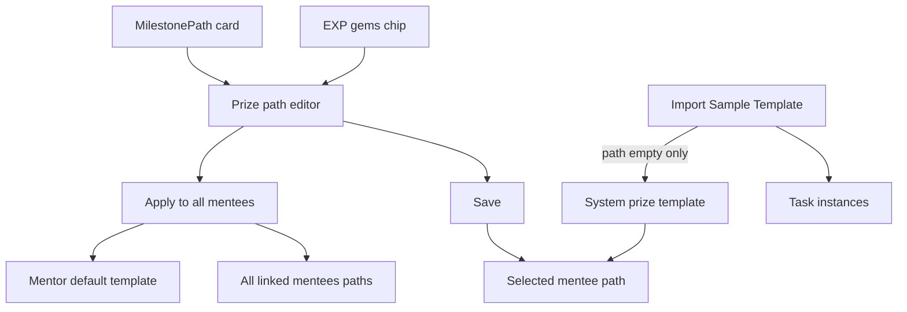

# Per-mentee prize path — edit, apply-all, import-when-empty

## Product rules (locked)

- **Per mentee, not family entity:** Each mentee has their own prize path rows. Co-mentors see/edit the same mentee path when that mentee is selected.
- **Empty by default:** New mentees start with **no** prize stops (mirror blank tasks). Dashboard must handle empty without looking broken.
- **Two parent entry points (same editor):**
  1. Header **EXP → gems** chip ([`DashboardClient`](src/components/dashboard/DashboardClient.tsx) `aria-label="Your EXP and gems"`).
  2. Compact **MilestonePath** card in the swipe-open header panel ([`MilestonePath`](src/components/progress/MilestonePath.tsx) compact root).
- **Child:** Can open the same surfaces **read-only** (progress + prize names); no Save / Apply.
- **Save:** Persist path for the **currently selected mentee** only.
- **Apply to all my mentees (and future):** Next to Save. Copies this path to every linked mentee **now**, and stores it as the **mentor’s default template** for mentees created later.
- **Import Sample Template** ([`import_template`](src/app/api/tasks/route.ts)):
  - Always: import tasks when Your Tasks is empty (existing).
  - **AND** mentee prize path is empty → also seed the **system** prize template (from `accumulative_reward.csv` / current seed content).
  - If path is **not** empty → tasks only; do not overwrite prizes.



## Current state (problem)

- Global [`milestones`](ref/supabase/schema.sql) + seed from [`accumulative_reward.csv`](ref/accumulative_reward.csv).
- Dashboard always `select * from milestones` ([`dashboard/page.tsx`](src/app/(dashboard)/dashboard/page.tsx)).
- No parent edit API; chip and card are not interactive.
- New users either see **your** global ladder or “unavailable” if table empty — not a personal empty → optional template flow.

## Data model

### Tables / columns

**A. `mentee_milestones` (or `prize_path_stops`)** — one row per stop per mentee:

| Column | Notes |
|--------|--------|
| `id` | UUID PK |
| `user_id` | Mentee profile id |
| `gem_threshold` | Integer; unique per mentee `(user_id, gem_threshold)` |
| `title` | Optional short label |
| `prize_name` | Display name |
| `prize_description` | Optional |
| `icon` | Optional |
| `sort` / order by threshold | |

**B. Mentor default for future mentees** — pick one:

- `profiles.prize_path_default JSONB` on mentor, **or**
- `mentor_prize_templates (owner_id, stops JSONB/updated_at)`

Stored when parent presses **Apply to all…**. Used when a **new** mentee is linked/created (first-child, invite mentee).

**C. System template** (not per-user):

- Keep content of current seed / CSV as code or a flagged global table (`is_system_template`) used only for Import-when-empty and optional “Reset to sample”.
- Prefer `src/data/prize-path-template.json` (like quotes) so Vercel does not depend on `ref/`.

**D. `user_milestones` claims**

- Today FKs global `milestones.id`. Either:
  - Retarget claims to `mentee_milestones.id`, or
  - Defer claim/redeem UI to a follow-up and only ship path display + edit first.

**Recommendation for v1:** Ship path display + edit + import seed; keep claim API minimal or unchanged until claim UX is needed. If claim rows exist in prod, migrate carefully or leave global table as read-only archive.

### RLS

- Child: read own `mentee_milestones`.
- Parent: read/write for `user_id` in linked children.
- Service role for Apply-to-all / invite hooks as needed (same pattern as tasks).

## API

| Endpoint / action | Behavior |
|-------------------|----------|
| `GET` path for subject | Stops for selected mentee (parent) or self (child) |
| `PUT` path | Replace stops for one mentee (parent); validate unique ascending thresholds |
| `POST` apply-all | Copy stops → all `linked_children`; upsert mentor default |
| `import_template` extension | After task import success: if mentee has 0 prize stops → insert system template |

Also: on **mentee create** ([`first-child`](src/app/api/auth/first-child/route.ts), invite mentee): if mentor has default template → copy; else leave empty.

## UI

### Entries

1. **EXP → gems chip** → `button` / clickable; opens editor sheet.
2. **MilestonePath compact card** → `button` or `role="button"`; same sheet.
3. Empty path copy: e.g. “No prizes yet” / `0 / —` instead of “Milestone path unavailable” when empty is intentional.

### Editor sheet (parent)

- List rows: gem threshold + prize name (add / edit / delete).
- Footer: **Save** | **Apply to all mentees** (confirm dialog: replaces other mentees’ paths + sets future default).
- Child: same list, no footer actions.

### Dashboard wiring

- [`DashboardClient`](src/components/dashboard/DashboardClient.tsx): pass mentee-scoped milestones; wire both entries to one `PrizePathEditor` state.
- Progress math unchanged: mentee gems vs stop thresholds.

## Import interaction (detail)

```
import_template for child C:
  1. existing task rules (Your Tasks empty) …
  2. if count(mentee_milestones where user_id = C) == 0:
       insert system template stops for C
  3. return { tasksCreated, prizesSeeded: bool }
```

UI toast optional: “Imported tasks and sample prize path” vs “Imported tasks”.

## Out of scope (v1)

- Per-stop icons/images upload.
- Shop / claim redeem flow redesign.
- Editing global `milestones` table in-app.
- Auto-sync when co-mentor invites (path is on mentee rows already).

## Implementation order

1. SQL + types + system template JSON.
2. GET/PUT + dashboard read switch (empty-safe MilestonePath).
3. Editor UI + two entries + Save.
4. Apply to all + mentor default + future mentee copy.
5. Import AND empty-path seed.
6. Manual test matrix: new mentor+child, import once, edit one mentee, apply-all, second mentee invite, import when path already customized.

## Test plan

- [ ] New mentee: empty path; chip + card open editor; child read-only.
- [ ] Import with empty path → tasks + sample prizes; second import blocked by tasks rule; path unchanged if already filled.
- [ ] Save only selected mentee; Apply updates all linked + new invite gets default.
- [ ] Co-mentor selecting same mentee sees updated path.
- [ ] Vercel build: no import from `ref/accumulative_reward.csv`.
