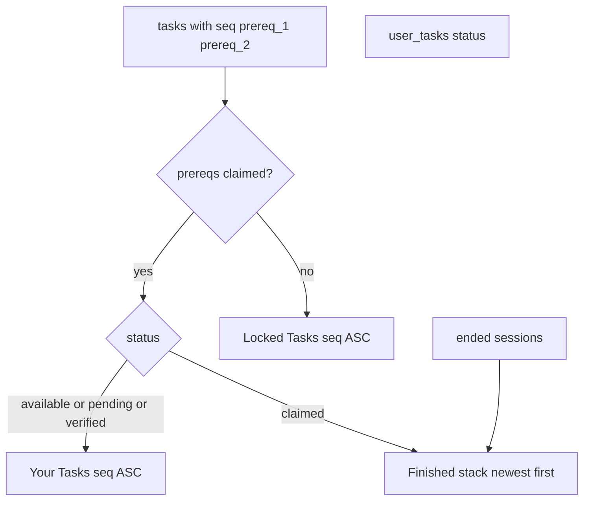

# Task list: sections, prereqs, CSV sync

## Confirmed product rules

- **Card mapping:** label = `task_no`, title = `category` (CSV `cat`), subtitle = `description` (CSV `des`), rewards = `exp`/`gem`.
- **Pending (child applied):** subtitle = `Pending`; right control = **X** that **dismisses** (resets `user_tasks` to `available`, clears `completed_at`) — default assumed.
- **Locked:** any of `prereq_1` / `prereq_2` is a `task_no` whose matching task is **not** `claimed` for that child, exp and gem will be greyed out in UI.
- **Finished tasks:** `claimed` only; order by `completed_at` desc.
- **Session log rows** in Finished: title `Tutorial Session` or `Working Session`, show earned EXP (and gem `0` if N/A), **no** `task_no`, **no** subtitle, **no** tick/X — record only.
- Parent view: same sections for linked children’s progress; parent still **approves** pending (check). Child dismisses with X.

## 1) SQL catalog sync (you already ALTERed columns)

Add `[supabase/sync_tasks_from_csv.sql](supabase/sync_tasks_from_csv.sql)` generated from `[ref/task_exp.csv](ref/task_exp.csv)`:

- Upsert all 23 real `task_no` rows: `seq`, `task_no`, `category`←cat, `title`←cat (keep title usable), `description`←des, `exp`, `gem`, `prereq_1`, `prereq_2`.
- Skip empty `Working Session` / `Tutorial Session` CSV lines (not DB rows).
- `Soc_Project_*` currently has mojibake (`????`) — upsert with those CSV strings as-is; you can re-run after fixing the CSV encoding.
- Optional cleanup: soft note to delete obsolete task_nos no longer in CSV (e.g. old `ENG_SPEAK_*` casing) only if you want a clean catalog — include `DELETE` of tasks whose `task_no` is not in the new set **after** confirming no important progress, or leave orphans and let UI ignore missing seq.

Also patch `[supabase/schema.sql](supabase/schema.sql)` to document `seq`, `prereq_1`, `prereq_2`.

**You run** the sync SQL in Supabase once after it is generated.

## 2) Types + seed status fix

- `[src/types/index.ts](src/types/index.ts)`: `Task.category` → `string`; add `seq`, `prereq_1`, `prereq_2` (`string | null`).
- `[src/lib/user-tasks.ts](src/lib/user-tasks.ts)`: insert missing rows as `**available**`, not `pending` (current bug).

## 3) API

- `[src/app/api/tasks/route.ts](src/app/api/tasks/route.ts)`:
  - GET: `order("seq")`; return `tasks` + `userTasks`.
  - POST `dismiss`: child-only; set matching `user_task` to `available`, `completed_at: null` when current status is `pending`.
- Dashboard data: load ended **sessions** for the child subject(s) (from existing session queries / small fetch in `[src/app/(dashboard)/dashboard/page.tsx](src/app/(dashboard)`/dashboard/page.tsx)) and pass into the client as finished-log items (`id`, `ended_at`, `exp_earned`, `is_tutorial`).

## 4) UI partitioning

Rewrite `[src/components/tasks/TaskList.tsx](src/components/tasks/TaskList.tsx)` (used flat on dashboard):

- Build lock set: claimed `task_no`s → unlock dependents.
- Three collapsible sections (chevron on right, default open):
  - **Your Tasks** — unlocked + not claimed (includes pending/verified); sort `seq` ASC.
  - **Locked Tasks** — locked; sort `seq` ASC; show lock glyph + short lock hint optional.
  - **Finished Tasks** — claimed tasks + session rows; sort by finish time DESC.
- Remove `limit={7}` from `[DashboardClient](src/components/dashboard/DashboardClient.tsx)` so all tasks show.
- Headers: “Your Tasks” / “Locked Tasks” / “Finished Tasks” with collapse toggle.

## 5) TaskCard updates

`[src/components/tasks/TaskCard.tsx](src/components/tasks/TaskCard.tsx)`:

- Title line uses `task.category` (cat); subtitle = `des` unless pending child → `Pending`.
- Pending child: action = dismiss (X icon), not check.
- Parent pending: keep approve (check).
- Verified child: keep claim (check).
- Finished / session-style **log** variant: hide task_no + subtitle + action button; show title + exp/gem only (reuse for sessions via a slim `FinishedLogCard` or `TaskCard` `variant="log"`).

## 6) Out of scope

- Reintroducing shop/tasks multi-pages.
- Fixing Soc_Project Chinese text (CSV re-export).
- Changing gem formula for sessions.

